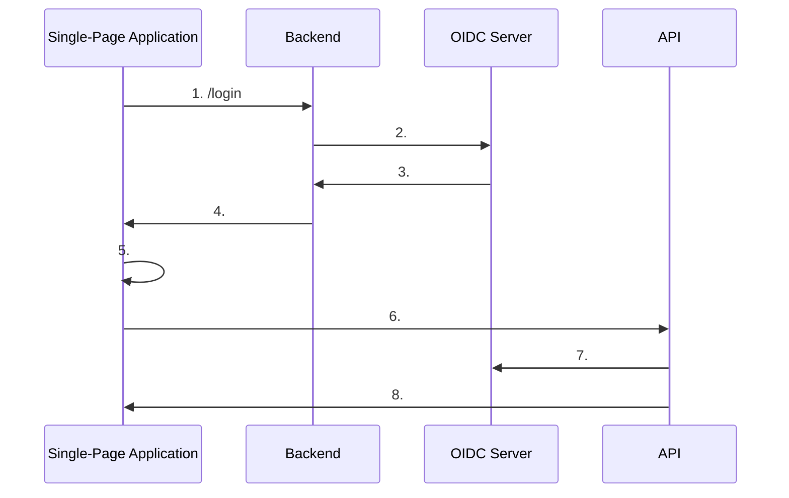
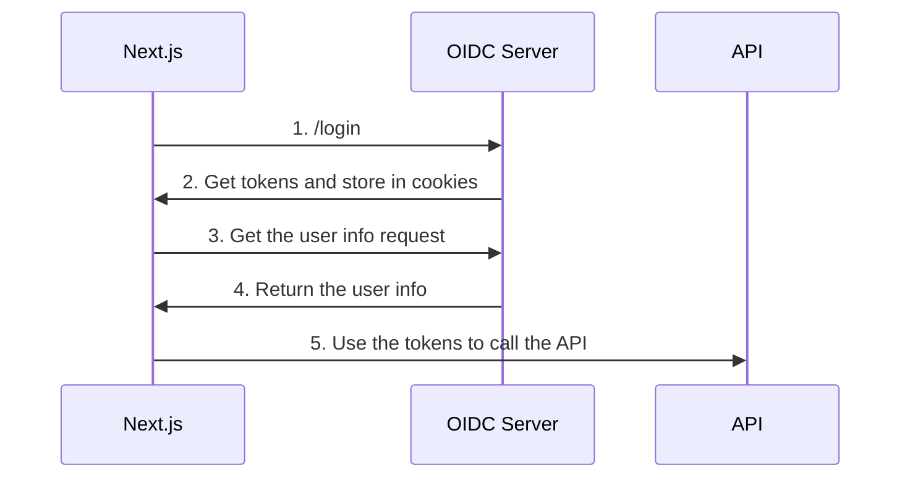

# OpenID Connect with Next.js

Most of the time, I use Next-auth for authentication in my Next.js apps. But the problem with Next-auth is that it does not support Multitenancy for self-hosted apps. If you want to know more about this you can check out the [issue](https://github.com/nextauthjs/next-auth/issues/600). So I thought it would be a good idea to write a post on how to implement OpenID Connect with Next.js. if you have only one tenant or you are hosting your app on Vercel, you can use Next-auth. But if you have multiple tenants or you are hosting your app on your own server, then this post might be helpful for you.

## Where is the code?

You can find the code for this post in the [github repo](https://github.com/antosubash/nextjs-iron-session-oidc).

## What is OpenID Connect?

OpenID Connect is a simple identity layer on top of the OAuth 2.0 protocol. It allows clients to verify the identity of the end-user based on the authentication performed by an authorization server, as well as to obtain basic profile information about the end-user in an interoperable and REST-like manner.

## What is my use case?

Most of my backend services are written in .Net. So I have Openiddict as my OpenID Connect server and I want to use this server to authenticate my Next.js app. All my API calls are authenticated using JWT tokens. So I wanted to do the same with my Next.js app.

## What are current options?

There are few libraries that support OpenID Connect and OAuth for the react app. Most notable one is [oidc-client-ts](https://github.com/authts/oidc-client-ts) and [react-oidc-context](https://github.com/authts/react-oidc-context). They are great options if you are using react. But I wanted something which will not store the tokens in the local storage. I wanted something which will store the tokens in the cookies.

## Why cookies?

I wanted to implement the BFF pattern. So I wanted to store the tokens in the cookies. This way I can use the same tokens for my backend services.

the most common BFF pattern looks like this



Now lets make this work with Next.js. Make the nextjs app as BFF backend and the frontend and store the tokens in the cookies. Then use the same tokens for the backend services. The workflow will look like this



As you can see, we are storing the tokens in the cookies and using the same tokens to call the API. This way we can use the same tokens for the backend services.

## How to implement OpenID Connect with Next.js?

To implement OpenID Connect with Next.js, we will use the [openid-client](https://github.com/panva/node-openid-client) library. This library is a certified OpenID Connect client library for node.js. This library is used by many projects and is well maintained. for the cookies we will use [iron-session](https://github.com/vvo/iron-session) library. This library is a simple session middleware for Next.js.

We will also use the [io-redis](https://github.com/redis/ioredis) library to store the refresh tokens in the redis. This way we can refresh the tokens without the user logging in again.

## Lets get started

First, lets create a new Next.js app

```bash
npx create-next-app@latest next-oidc-sample
```

Next, lets install the required libraries

```bash
npm install openid-client iron-session ioredis jwt-decode
```

lets create a config file for the OpenID Connect client

```ts
export const clientConfig = {
  url: process.env.NEXT_PUBLIC_API_URL,
  audience: process.env.NEXT_PUBLIC_API_URL,
  client_id: process.env.NEXT_PUBLIC_CLIENT_ID,
  scope: process.env.NEXT_PUBLIC_SCOPE,
  redirect_uri: `${process.env.NEXT_PUBLIC_APP_URL}/auth/openiddict`,
  post_logout_redirect_uri: `${process.env.NEXT_PUBLIC_APP_URL}`,
  response_type: 'code',
  grant_type: 'authorization_code',
  post_login_route: `${process.env.NEXT_PUBLIC_APP_URL}`,
}
```

Next, Add the `env` variables to the `.env` file

```bash
NEXT_PUBLIC_API_URL=https://abp.antosubash.com
NEXT_PUBLIC_CLIENT_ID=AbpReact_Next_App
NEXT_PUBLIC_APP_URL=http://localhost:3000
NEXT_PUBLIC_SCOPE='openid profile email AbpTemplate offline_access'
REDIS_HOST="localhost"
REDIS_PASSWORD=""
REDIS_PORT="6379"
```

I´m using the ABP template as my OpenID Connect server. You can use any OpenID Connect server.

Now lets create `lib.ts` file

```ts
import { IronSession, getIronSession } from 'iron-session'
import { cookies } from 'next/headers'
import { Issuer } from 'openid-client'
import { clientConfig } from './config'
import { sessionOptions } from './sessionOptions'
import { isTokenExpired, refreshToken } from './utils/auth'
import { createRedisInstance } from './utils/redis'
import { tenantGetTenantGuid, tenantGetTenantHost } from './client'

export interface SessionData {
  isLoggedIn: boolean
  access_token?: string
  code_verifier?: string
  userInfo?: {
    sub: string
    name: string
    email: string
    email_verified: boolean
  }
  tenantId?: string
}

export const defaultSession: SessionData = {
  isLoggedIn: false,
  access_token: undefined,
  code_verifier: undefined,
  userInfo: undefined,
  tenantId: undefined,
}

export async function getSession(): Promise<IronSession<SessionData>> {
  let session = await getIronSession<SessionData>(cookies(), sessionOptions)
  try {
    if (session.access_token && isTokenExpired(session.access_token!)) {
      const redis = createRedisInstance()
      const client = await getClient()
      await refreshToken(session, client, redis)
      return await getSession()
    }
    if (!session.isLoggedIn) {
      session.isLoggedIn = defaultSession.isLoggedIn
      session.access_token = defaultSession.access_token
      session.userInfo = defaultSession.userInfo
    }
    return session
  } catch (error) {
    console.error('Error getting session:', error)
    session.isLoggedIn = defaultSession.isLoggedIn
    session.access_token = defaultSession.access_token
    session.userInfo = defaultSession.userInfo
    return session
  }
}

export async function getClient() {
  const abpIssuer = await Issuer.discover(clientConfig.url!)
  const client = new abpIssuer.Client({
    client_id: clientConfig.client_id!,
    response_types: ['code'],
    redirect_uris: [clientConfig.redirect_uri],
    token_endpoint_auth_method: 'none',
  })
  return client
}

export async function setTenantWithHost(host: string) {
  const session = await getSession()
  if (session.tenantId) {
    return
  }
  var tenantGuid = await tenantGetTenantGuid({ host: host })
  session.tenantId = tenantGuid
  await session.save()
}
```
