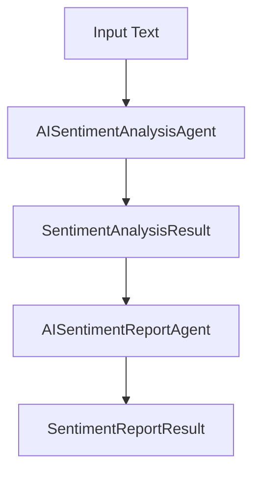

<TOCInline toc={props.toc} asDisclosure />

## Introduction

In this post, we will learn how to build sentiment analysis with Microsoft Agent Framework and Ollama. We will use the Ollama model to perform the sentiment analysis and the Microsoft Agent Framework to build the agent.

## Prerequisites

Before we start, make sure you have the following installed on your machine:

- [Ollama](https://ollama.com)
- [dotnet](https://dotnet.microsoft.com/download)
- [Microsoft Agent Framework](https://github.com/microsoft/agent-framework)

Make sure you read the previous blog post [Building AI Agents with Microsoft Agent Framework and Ollama: A Getting Started Guide](/posts/agent-framework-ollama) to get started with Microsoft Agent Framework and Ollama. This blog post is a continuation of the previous blog post.

## What is sentiment analysis?

Sentiment analysis is a type of text classification task that involves determining the sentiment or emotional tone of a piece of text. It is a common NLP (Natural Language Processing) task used to analyze and understand the sentiment expressed in written language. The goal is to classify the text into one of several predefined sentiment categories, such as positive, negative, neutral, or mixed.

## What is the Microsoft Agent Framework?

The Microsoft Agent Framework is an open-source development kit for building AI agents and multi-agent workflows for .NET and Python. It brings together and extends ideas from the Semantic Kernel and AutoGen projects, combining their strengths while adding new capabilities. Built by the same teams, it is the unified foundation for building AI agents going forward.

The Agent Framework offers two primary categories of capabilities:

- AI Agents: individual agents that use LLMs to process user inputs, call tools and MCP servers to perform actions, and generate responses. Agents support model providers including Azure OpenAI, OpenAI, and Azure AI.

- Workflows: graph-based workflows that connect multiple agents and functions to perform complex, multi-step tasks. Workflows support type-based routing, nesting, checkpointing, and request/response patterns for human-in-the-loop scenarios.

The framework also provides foundational building blocks, including model clients (chat completions and responses), an agent thread for state management, context providers for agent memory, middleware for intercepting agent actions, and MCP clients for tool integration. Together, these components give you the flexibility and power to build interactive, robust, and safe AI applications.

## What is Ollama?

Ollama is a lightweight, open-source, and fast local AI model serving framework that enables developers to run and manage LLMs locally without relying on external APIs. It provides a simple and easy to use interface to interact with the LLM. It also provides a Open AI like API to interact with the LLM. Ollama has sdk for python and javascript. you can find more about Ollama [here](https://ollama.com)

## Code Repository

You can find the full code for this blog post [here](https://github.com/antosubash/agent-framework-sentiment-analysis)

### 🎯 Overview

The Sentiment Analysis Workflow showcases a **two-stage sequential AI pipeline** that combines specialized agents to deliver comprehensive sentiment insights:

1. **AISentimentAnalysisAgent** - Performs deep sentiment analysis with contextual understanding
2. **AISentimentReportAgent** - Generates detailed, actionable reports based on analysis results

### 🏗️ Architecture



The workflow follows a clean sequential pattern where:

- The first agent analyzes the input and produces structured analysis data
- The second agent consumes this structured data to generate comprehensive reports
- Each stage provides confidence scores and reasoning for transparency

### 🔍 Key Features

#### 1. **Intelligent Sentiment Detection**

The `AISentimentAnalysisAgent` goes beyond simple keyword matching by:

- Analyzing context and tone
- Identifying emotional cues
- Providing sentiment scores ranging from -1.0 (very negative) to 1.0 (very positive)
- Detecting positive and negative language indicators
- Offering confidence scores for reliability assessment

#### 2. **Comprehensive Report Generation**

The `AISentimentReportAgent` transforms raw analysis into actionable insights:

- Professional, well-formatted reports
- Detailed metrics (word counts, sentiment scaling)
- Actionable recommendations
- Confidence-weighted conclusions

#### 3. **Structured Data Flow**

The workflow uses strongly-typed data structures:

- `SentimentAnalysisResult` - Contains analysis with sentiment type, score, indicators, and reasoning
- `SentimentReportResult` - Contains final report with metrics and insights
- `SentimentType` enum - Type-safe sentiment classification

## 💻 Code Samples

### Project Setup

First, ensure you have the necessary NuGet packages in your `.csproj`:

```xml
<ItemGroup>
  <PackageReference Include="Microsoft.Agents.AI" Version="1.0.0-preview.251016.1" />
  <PackageReference Include="Microsoft.Agents.AI.Workflows" Version="1.0.0-preview.251016.1" />
  <PackageReference Include="OllamaSharp" Version="5.4.8" />
</ItemGroup>
```

### Data Structures

The workflow uses strongly-typed records for data transfer:

```csharp
// SentimentAnalysisResult.cs
internal sealed record SentimentAnalysisResult(
    string OriginalText,
    double SentimentScore,
    SentimentType Sentiment,
    double Confidence,
    string Reasoning,
    List<string> PositiveIndicators,
    List<string> NegativeIndicators);

internal sealed record SentimentReportResult(
    string OriginalText,
    double SentimentScore,
    SentimentType Sentiment,
    string Report,
    Dictionary<string, int> Metrics,
    double Confidence,
    string Reasoning);

internal enum SentimentType
{
    Positive,
    Neutral,
    Negative
}
```

### Main Program Setup

The main program initializes the Ollama client and creates the workflow:

```csharp
using Microsoft.Agents.AI.Workflows;
using Microsoft.Agents.AI;
using OllamaSharp;

var endpoint = "http://localhost:11434";
var modelName = "qwen3:8b";

const string AgentName = "Sentiment Analyzer";
const string AgentInstructions = "You are an expert at analyzing sentiment in text and generating detailed reports.";

using OllamaApiClient chatClient = new(new Uri(endpoint), modelName);
AIAgent agent = new ChatClientAgent(chatClient, AgentInstructions, AgentName);

// Create and execute the workflow
var sentimentAnalysisAgent = new AISentimentAnalysisAgent(agent);
var sentimentReportAgent = new AISentimentReportAgent(agent);

var builder = new WorkflowBuilder(sentimentAnalysisAgent);
builder.AddEdge(sentimentAnalysisAgent, sentimentReportAgent)
       .WithOutputFrom(sentimentReportAgent);
var workflow = builder.Build();

var testText = "I absolutely love this product! It's fantastic!";
Run run = await InProcessExecution.RunAsync(workflow, testText);
```

### AISentimentAnalysisAgent Implementation

This agent analyzes sentiment and returns structured results:

```csharp
using Microsoft.Agents.AI.Workflows;
using Microsoft.Agents.AI.Workflows.Reflection;
using Microsoft.Agents.AI;

internal sealed class AISentimentAnalysisAgent(AIAgent agent)
    : ReflectingExecutor<AISentimentAnalysisAgent>("AISentimentAnalysisAgent"),
      IMessageHandler<string, SentimentAnalysisResult>
{
    private readonly AIAgent _agent = agent;

    public async ValueTask<SentimentAnalysisResult> HandleAsync(
        string input,
        IWorkflowContext context,
        CancellationToken cancellationToken = default)
    {
        if (string.IsNullOrWhiteSpace(input))
        {
            return new SentimentAnalysisResult(
                input, 0.0, SentimentType.Neutral, 1.0,
                "Empty input - neutral sentiment", [], []);
        }

        var prompt = "Analyze the sentiment of the following text. " +
                    "Determine if it is positive, negative, or neutral, and provide a sentiment score.\n\n" +
                    $"Text to analyze: \"{input}\"\n\n" +
                    "Please respond in the following JSON format:\n" +
                    "{\n" +
                    "    \"sentiment\": \"positive\" | \"negative\" | \"neutral\",\n" +
                    "    \"sentimentScore\": -1.0 to 1.0,\n" +
                    "    \"confidence\": 0.0-1.0,\n" +
                    "    \"positiveIndicators\": [\"word1\", \"word2\"],\n" +
                    "    \"negativeIndicators\": [\"word1\", \"word2\"],\n" +
                    "    \"reasoning\": \"Brief explanation of your sentiment analysis\"\n" +
                    "}\n\n" +
                    "Be thorough and consider context, tone, and emotional cues.";

        var response = await _agent.RunAsync(prompt);
        var responseText = response.ToString();

        var sentiment = ExtractSentimentType(responseText);
        var sentimentScore = ExtractSentimentScore(responseText);
        var confidence = ExtractConfidence(responseText);
        var positiveIndicators = ExtractIndicators(responseText, "positiveIndicators");
        var negativeIndicators = ExtractIndicators(responseText, "negativeIndicators");
        var reasoning = ExtractReasoning(responseText);

        return new SentimentAnalysisResult(
            input, sentimentScore, sentiment, confidence,
            reasoning, positiveIndicators, negativeIndicators);
    }

    // Helper methods for parsing JSON response
    private static SentimentType ExtractSentimentType(string response)
    {
        if (response.Contains("\"sentiment\": \"positive\"", StringComparison.OrdinalIgnoreCase))
            return SentimentType.Positive;
        else if (response.Contains("\"sentiment\": \"negative\"", StringComparison.OrdinalIgnoreCase))
            return SentimentType.Negative;
        return SentimentType.Neutral;
    }

    private static double ExtractSentimentScore(string response)
    {
        var scoreMatch = System.Text.RegularExpressions.Regex.Match(
            response, @"""sentimentScore"":\s*([-]?[0-9.]+)");
        if (scoreMatch.Success && double.TryParse(scoreMatch.Groups[1].Value, out var score))
        {
            return Math.Clamp(score, -1.0, 1.0);
        }
        return 0.0;
    }

    // Additional extraction methods...
}
```

### AISentimentReportAgent Implementation

This agent generates comprehensive reports from analysis results:

```csharp
internal sealed class AISentimentReportAgent(AIAgent agent)
    : ReflectingExecutor<AISentimentReportAgent>("AISentimentReportAgent"),
      IMessageHandler<SentimentAnalysisResult, SentimentReportResult>
{
    private readonly AIAgent _agent = agent;

    public async ValueTask<SentimentReportResult> HandleAsync(
        SentimentAnalysisResult input,
        IWorkflowContext context,
        CancellationToken cancellationToken = default)
    {
        var prompt = "Generate a comprehensive sentiment analysis report based on the following analysis results.\n\n" +
                    $"Original Text: \"{input.OriginalText}\"\n" +
                    $"Detected Sentiment: {input.Sentiment}\n" +
                    $"Sentiment Score: {input.SentimentScore:F2}\n" +
                    $"Confidence: {input.Confidence:P1}\n" +
                    $"Positive Indicators: {string.Join(", ", input.PositiveIndicators)}\n" +
                    $"Negative Indicators: {string.Join(", ", input.NegativeIndicators)}\n" +
                    $"AI Reasoning: {input.Reasoning}\n\n" +
                    "Please respond in the following JSON format:\n" +
                    "{\n" +
                    "    \"report\": \"A comprehensive, well-formatted sentiment analysis report\",\n" +
                    "    \"metrics\": {\n" +
                    "        \"PositiveWords\": number,\n" +
                    "        \"NegativeWords\": number,\n" +
                    "        \"TotalWords\": number,\n" +
                    "        \"SentimentScoreScaled\": number (score * 100)\n" +
                    "    },\n" +
                    "    \"confidence\": 0.0-1.0,\n" +
                    "    \"reasoning\": \"Brief explanation of report generation\"\n" +
                    "}\n\n" +
                    "The report should be detailed, professional, and include actionable insights.";

        var response = await _agent.RunAsync(prompt);
        var responseText = response.ToString();

        var report = ExtractReport(responseText);
        var metrics = ExtractMetrics(responseText);
        var confidence = ExtractConfidence(responseText);
        var reasoning = ExtractReasoning(responseText);

        return new SentimentReportResult(
            input.OriginalText, input.SentimentScore, input.Sentiment,
            report, metrics, confidence, reasoning);
    }

    // Extraction methods for parsing JSON response...
}
```

### Processing Workflow Events

After running the workflow, process the events to extract results:

```csharp
Run run = await InProcessExecution.RunAsync(workflow, testText);

foreach (WorkflowEvent evt in run.NewEvents)
{
    if (evt is ExecutorCompletedEvent executorComplete)
    {
        Console.WriteLine($"Agent '{executorComplete.ExecutorId}' completed:");

        if (executorComplete.Data is SentimentAnalysisResult analysisResult)
        {
            Console.WriteLine($"  Original Text: {analysisResult.OriginalText}");
            Console.WriteLine($"  Sentiment: {analysisResult.Sentiment}");
            Console.WriteLine($"  Sentiment Score: {analysisResult.SentimentScore:F2}");
            Console.WriteLine($"  Confidence: {analysisResult.Confidence:P1}");
            if (analysisResult.PositiveIndicators.Count > 0)
            {
                Console.WriteLine($"  Positive Indicators: {string.Join(", ", analysisResult.PositiveIndicators)}");
            }
            if (analysisResult.NegativeIndicators.Count > 0)
            {
                Console.WriteLine($"  Negative Indicators: {string.Join(", ", analysisResult.NegativeIndicators)}");
            }
            Console.WriteLine($"  Reasoning: {analysisResult.Reasoning}");
        }
        else if (executorComplete.Data is SentimentReportResult reportResult)
        {
            Console.WriteLine($"  Sentiment: {reportResult.Sentiment}");
            Console.WriteLine($"  Sentiment Score: {reportResult.SentimentScore:F2}");
            Console.WriteLine($"  Confidence: {reportResult.Confidence:P1}");
            Console.WriteLine($"  Metrics: {string.Join(", ", reportResult.Metrics.Select(m => $"{m.Key}: {m.Value}"))}");
            Console.WriteLine($"  Reasoning: {reportResult.Reasoning}");
            Console.WriteLine($"  Report:\n{reportResult.Report}");
        }
    }
}
```

## 📊 Real-World Applications

This workflow pattern is ideal for:

- **Customer Feedback Analysis** - Process reviews and support tickets at scale
- **Social Media Monitoring** - Track brand sentiment across platforms
- **Content Moderation** - Assess emotional tone of user-generated content
- **Market Research** - Analyze public opinion from surveys and interviews
- **Product Development** - Understand user reactions to features and updates

## 🎓 Learning Outcomes

Building this workflow demonstrates:

1. **Sequential Workflow Design** - How to chain specialized agents for complex tasks
2. **Type-Safe Data Contracts** - Using records and enums for structured communication
3. **AI Integration Patterns** - Connecting local LLMs (Ollama) with the Agent Framework
4. **Prompt Engineering** - Crafting prompts that yield structured, parseable responses
5. **Error Resilience** - Handling LLM response variations gracefully

## 🚀 Running the Demo

### Prerequisites

- .NET 10.0 or later
- Ollama running locally with the `qwen3:8b` model

### Setup

1. Start Ollama and pull the required model:

```bash
ollama pull qwen3:8b
ollama serve
```

2. Navigate to the project directory:

```bash
cd SentimentAnalysisWorkflow
```

3. Restore dependencies:

```bash
dotnet restore
```

4. Run the application:

```bash
dotnet run
```

The demo processes multiple test cases showcasing:

- Highly positive sentiment ("I absolutely love this product!")
- Negative sentiment ("This is the worst experience...")
- Neutral sentiment ("The service was adequate...")
- Emotional extremes ("I'm thrilled and overjoyed!")
- Concerned sentiment ("I'm really concerned about this issue...")

## 📈 Sample Output

```
🤖 SENTIMENT ANALYSIS WORKFLOW DEMO
====================================

🤖 Processing: "I absolutely love this product! It's fantastic and exceeded all my expectations!"

🤖 Agent 'AISentimentAnalysisAgent' completed:
  📝 Original Text: I absolutely love this product! It's fantastic and exceeded all my expectations!
  😊 Sentiment: Positive
  📊 Sentiment Score: 0.85
  🧠 Confidence: 95.0%
  ✅ Positive Indicators: love, absolutely, fantastic, exceeded, expectations
  💭 Reasoning: Strong positive language with enthusiastic tone...

🤖 Agent 'AISentimentReportAgent' completed:
  📄 Sentiment: Positive
  📊 Sentiment Score: 0.85
  🧠 Confidence: 92.0%
  📈 Metrics: PositiveWords: 8, NegativeWords: 0, TotalWords: 12, SentimentScoreScaled: 85
  💭 Reasoning: Generated comprehensive report with actionable insights...
  📋 Report:
  Sentiment Analysis Report
  ========================
  Overall sentiment: Highly Positive (Score: 0.85)
  The text demonstrates strong positive sentiment with enthusiastic language...
```

## 🔧 Customization Tips

1. **Adjust Sentiment Thresholds** - Modify score ranges in `AISentimentAnalysisAgent`
2. **Enhance Reporting** - Extend `AISentimentReportAgent` prompts for domain-specific insights
3. **Add More Stages** - Chain additional agents for categorization, summarization, or action items
4. **Stream Processing** - Adapt for real-time sentiment monitoring of live data streams
5. **Multi-Language Support** - Extend prompts to handle multiple languages

## 🎯 Key Takeaways

The Sentiment Analysis Workflow exemplifies how **specialized AI agents working in sequence** can produce more sophisticated results than a single monolithic agent. By breaking complex tasks into focused stages, we achieve:

- **Better Accuracy** - Each agent focuses on what it does best
- **Greater Flexibility** - Easy to modify individual stages without affecting others
- **Improved Maintainability** - Clear separation of concerns
- **Enhanced Transparency** - Each stage provides reasoning and confidence scores

This pattern scales beautifully to more complex workflows where you might chain 5, 10, or even more specialized agents together to solve intricate business problems.

## 🛠️ Implementation Highlights

### Agent Communication Pattern

The workflow builder creates a clean pipeline where data flows from one agent to the next:

```csharp
var builder = new WorkflowBuilder(sentimentAnalysisAgent);
builder.AddEdge(sentimentAnalysisAgent, sentimentReportAgent)
       .WithOutputFrom(sentimentReportAgent);
var workflow = builder.Build();
```

### AI Prompt Engineering

Both agents use carefully crafted prompts that:

- Request structured JSON responses for reliable parsing
- Include examples and formatting requirements
- Emphasize thoroughness and context awareness
- Specify confidence scoring requirements

### Robust Parsing

The agents include sophisticated JSON extraction logic that:

- Handles variations in LLM response formatting
- Uses regex patterns to extract structured data
- Includes fallback values for missing fields
- Validates and clamps numeric values to valid ranges

## 📁 Project Structure

```
SentimentAnalysisWorkflow/
├── Program.cs                    # Main application entry point
├── AISentimentAnalysisAgent.cs   # First stage: sentiment analysis
├── AISentimentReportAgent.cs     # Second stage: report generation
└── SentimentAnalysisResult.cs    # Data structures and types
```

# Conclusion

In this post, we learned how to build sentiment analysis with Microsoft Agent Framework and Ollama. We used the Ollama model to perform the sentiment analysis and the Microsoft Agent Framework to build the agent. We also learned how to build a sequential workflow to perform the sentiment analysis. Hopefully this will help you to build your own sentiment analysis application.
