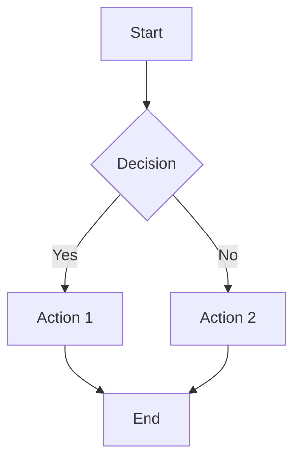
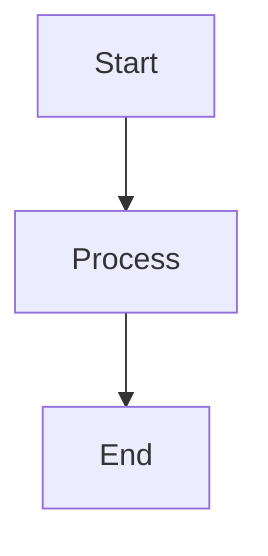
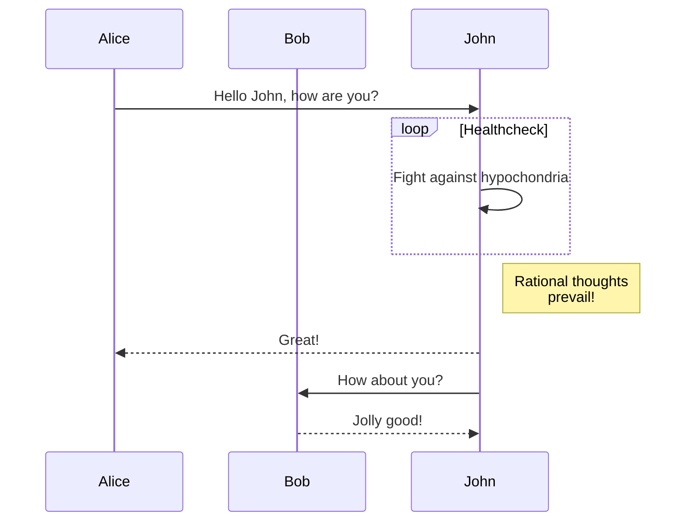
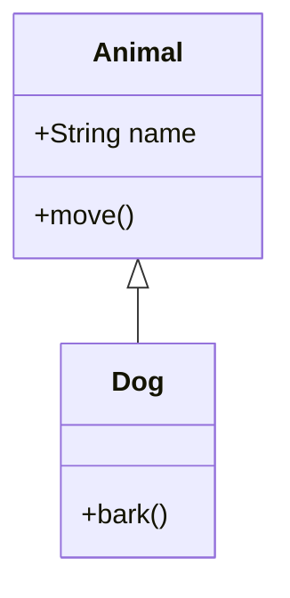
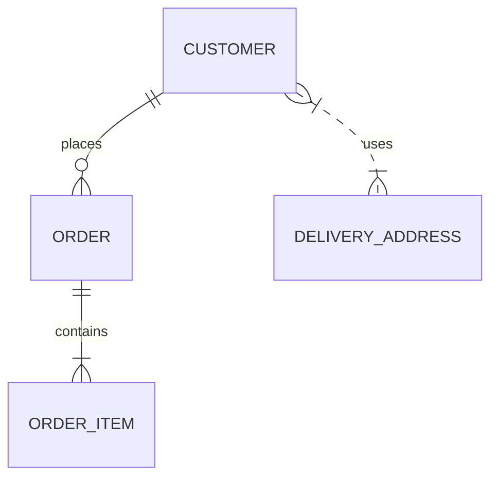
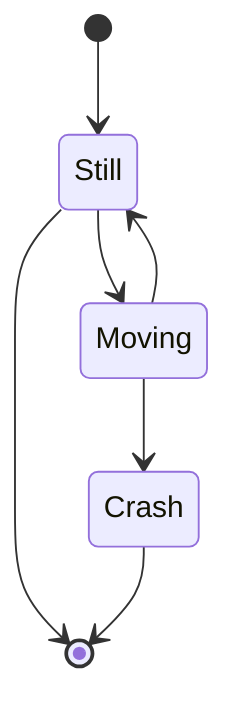
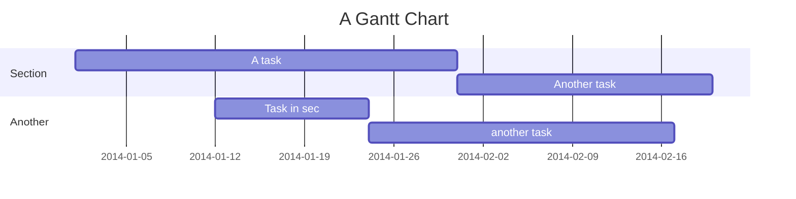
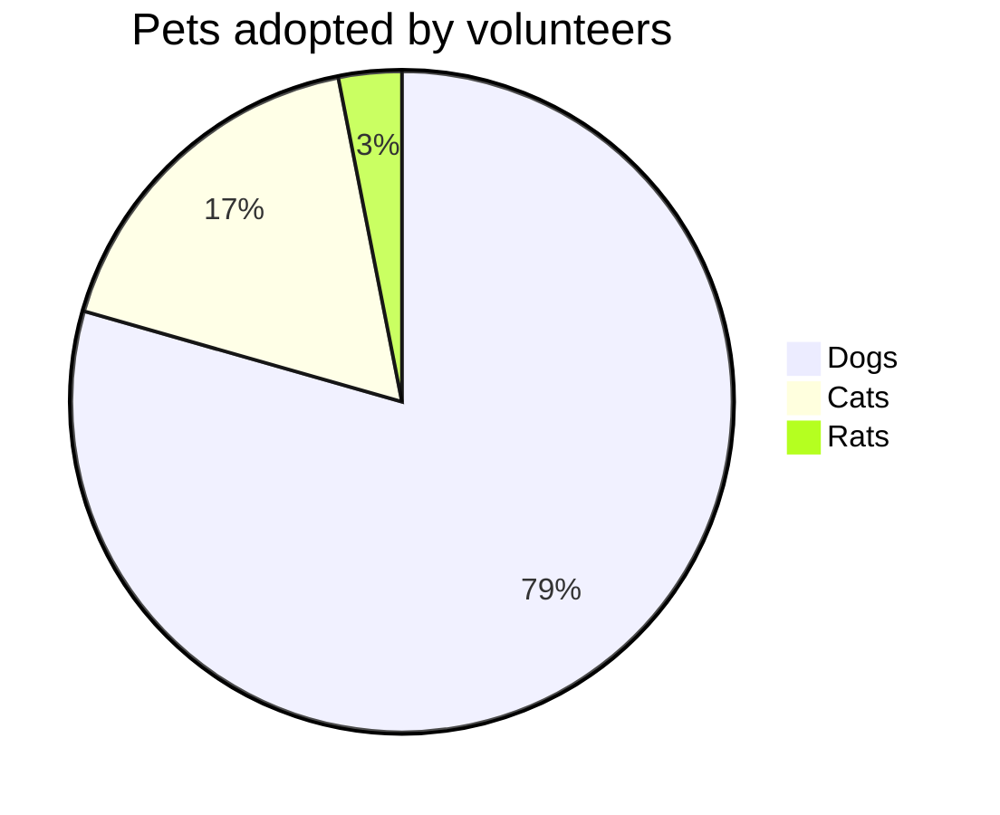

# Mermaid Diagrams Support

This blog now supports Mermaid diagrams! You can create beautiful flowcharts, sequence diagrams, and other diagrams directly in your MDX files.

## Usage

Simply wrap your Mermaid diagram code in a `mermaid` code block:

## Supported Diagram Types

Mermaid supports many types of diagrams:

### Flowcharts

### Sequence Diagrams

### Class Diagrams

### Entity Relationship Diagrams

### State Diagrams

### Gantt Charts

### Pie Charts

## Features

- **Responsive**: Diagrams automatically resize to fit the container
- **Dark Mode Support**: Diagrams adapt to light/dark themes
- **Error Handling**: If a diagram fails to render, an error message is shown with the code
- **Loading States**: Shows a loading spinner while rendering
- **Accessibility**: Proper ARIA labels and semantic HTML

## Configuration

The Mermaid component is configured with the following settings:

- Theme: Default (adapts to light/dark mode)
- Font: Inherits from the page
- Security: Loose (allows all features)
- Responsive: All diagram types use max-width for responsiveness

## Troubleshooting

If your diagram doesn't render:

1. Check the syntax in the [Mermaid Live Editor](https://mermaid.live/)
2. Ensure the code block is properly formatted with `mermaid` language identifier
3. Check the browser console for any JavaScript errors
4. Verify that the diagram code is valid Mermaid syntax

## Examples

You can find examples of Mermaid diagrams in the blog posts. The first example is in the ABP React CMS Module post, which shows a system architecture diagram.
